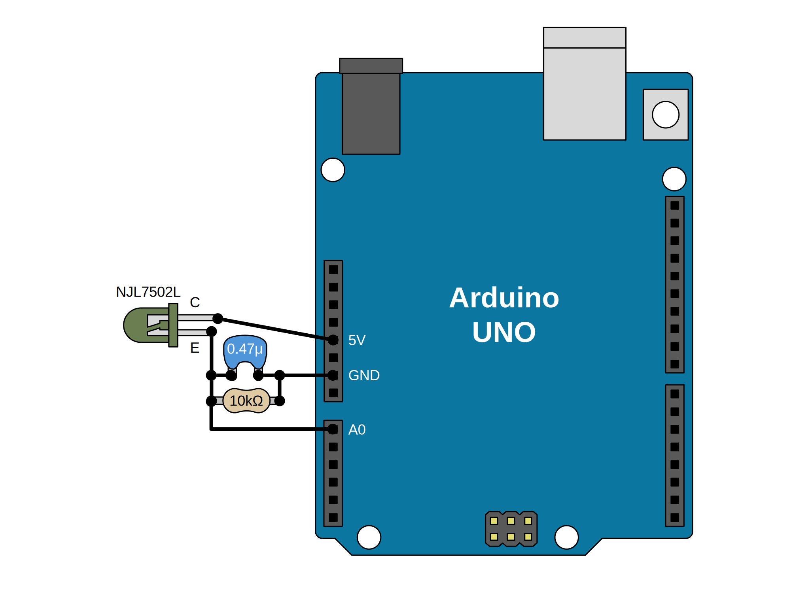

# VLConfig for Arduino

## About VLConfig

See [VLConfig](https://github.com/shapoco/vlconfig).

## Example

### Connection

### Sketch

See [VLConfigRxTest.ino](examples/VLConfigRxTest/VLConfigRxTest.ino).

