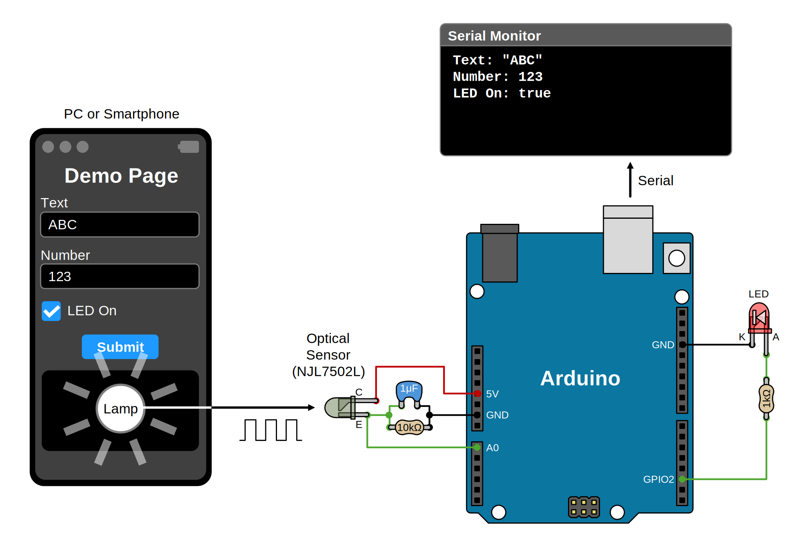

# [WIP] VLConfig for Arduino Platform

Protocol and library implementation for sending configuration information by flashing the screen of a PC or smartphone to devices that do not have a rich input interface.

リッチな入力インタフェースを持たないデバイスに対し、PC やスマートフォンの画面の点滅によって設定情報を送信するためのプロトコルおよびライブラリ実装です。

## About VLConfig

See [VLConfig](https://github.com/shapoco/vlconfig).

## Demo

### Demo Page

See [Demo Page](https://shapoco.github.io/vlconfig/demo/).

### Sketch

See [VLConfigRxTest.ino](examples/VLConfigRxTest/VLConfigRxTest.ino).

